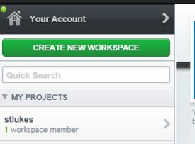
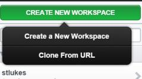
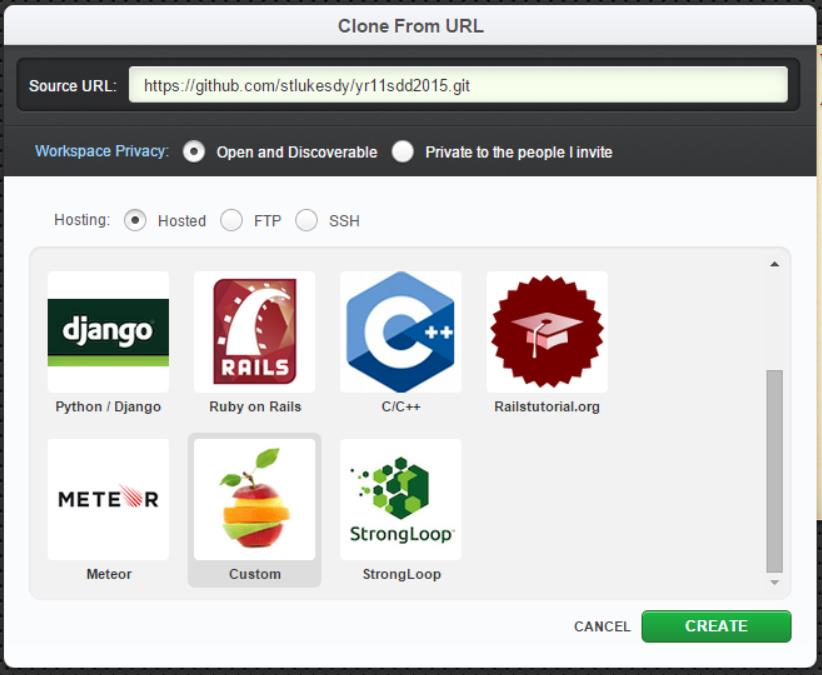
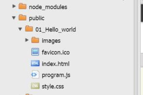

# yr11sdd2015

## Installation steps

1. logon to <a href="https://c9.io" target="_blank">c9.io</a>
2. Press green button `CREATE NEW WORKSPACE`<br />

3. Select `Clone From URL`<br />
  <br />
4. Paste the following url: 
```
  https://github.com/stlukesdy/yr11sdd2015.git
```
<br />

  - Select Workspace Privacy: **Open and Discoverable**<br />
  - Select **Custom**<br />
  - Click **Create**<br />

4. Select the new workspace `yr11sdd2015`.
5. Click **START EDITING**. Wait until loaded.
6. In your bash shell type the following command:<br /><br />
```
npm install
```
7. Again, in your bash shell type the following command:<br /><br />
```
grunt
```

8. Open in chrome `https://yr11sdd2015-{your username}.c9.io/`
9. Find the code files in cloud 9 file explorer:<br />



## Update steps


1. logon to <a href="https://c9.io" target="_blank">c9.io</a>
2. Select the new workspace `yr11sdd2015`.
3. Click **START EDITING**. Wait until loaded.
4. Open new Terminal Alt-T (Window --> New Terminal).
5. In your new terminal bash shell type the following command:`git pull`
6. Close the new Terminal created in step 4.

## npm install in directory "node"

1. logon to <a href="https://c9.io" target="_blank">c9.io</a>
2. Select the new workspace `yr11sdd2015`.
3. Click **START EDITING**. Wait until loaded. 
4. Right click the folder "node" and select "Open Terminal Here Alt-L"
5. In the new bash terminal window type `npm install`
6. Close the new Terminal created in step 4.


## run a node program

1. Right click the .js file you want to run e.g. `node/teacher/01_Sequential_files/program.js`


## Useful bash shell commands

clear - clear the terminal screen

    clear

pwd - print name of current/working directory

    pwd

dir - list directory contents

    dir


cd - change directory

    cd

